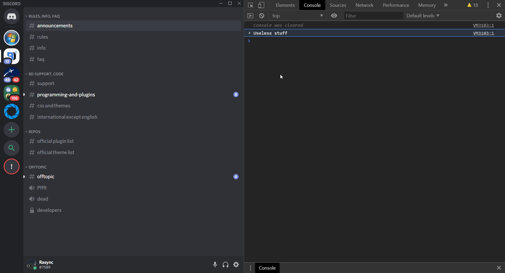
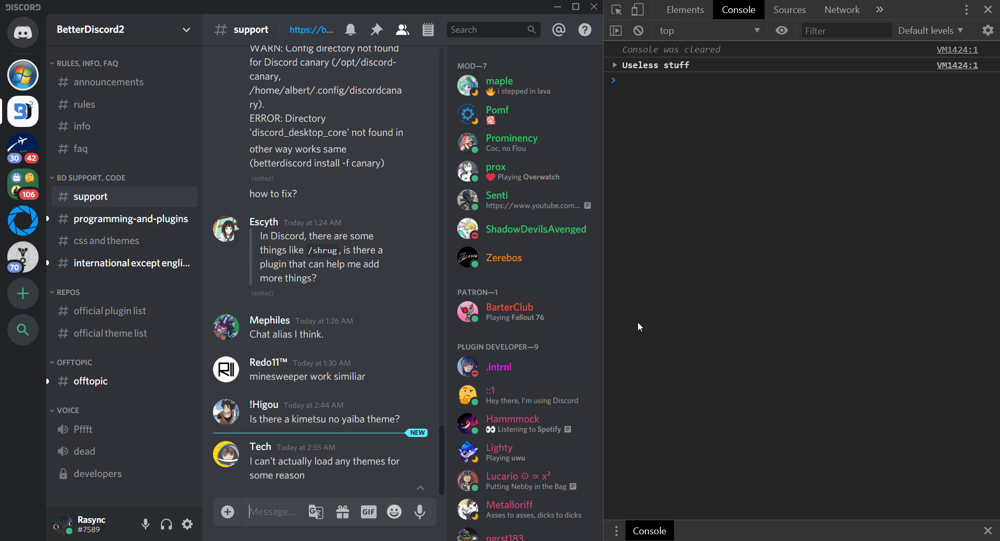
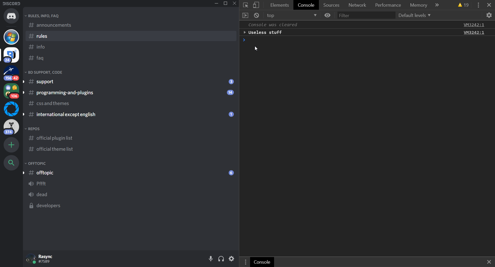
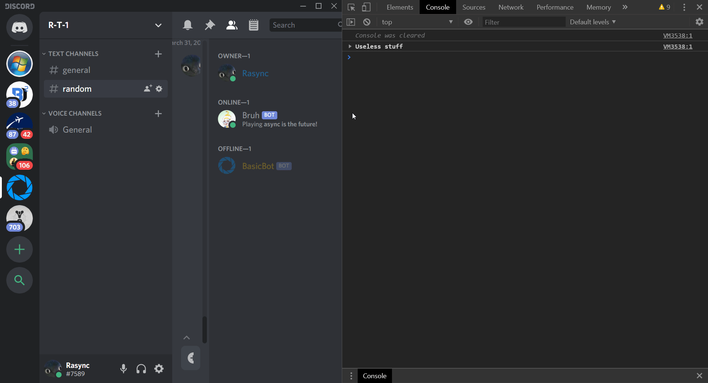
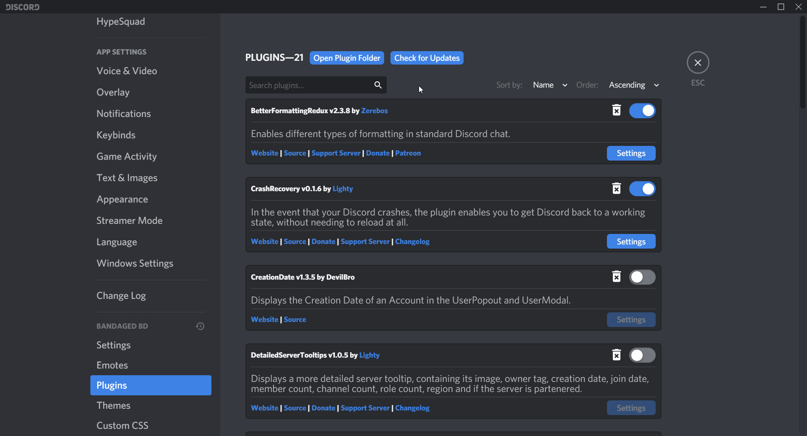
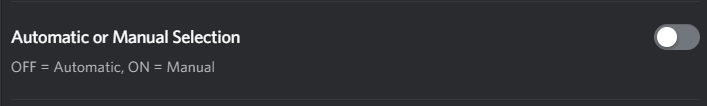
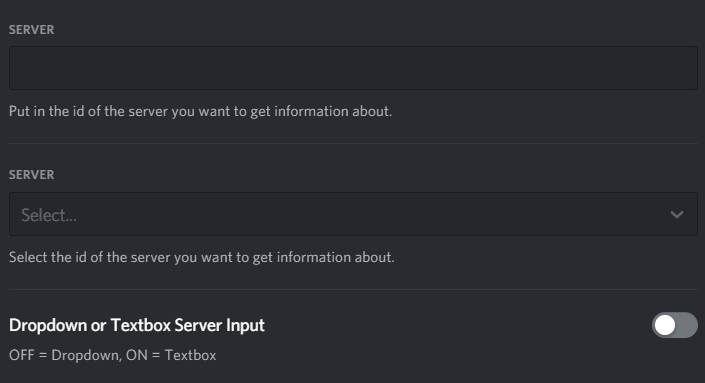
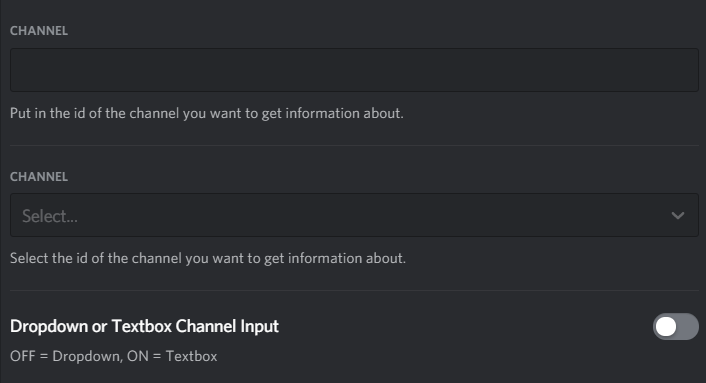
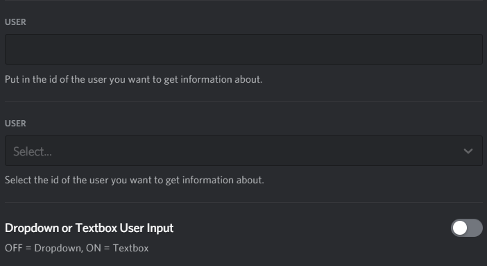

# Random Discord Tools   

A plugin for [Bandaged BetterDiscord (BDB)](https://github.com/rauenzi/BetterDiscordApp) that has some random, potentially useful tools.

* **[Get Server Information](#Get-Server-Information)**

  * [Automatic Server Selection](#Automatic-Server-Selection)

  * [Manual Server Selection](#Manual-Server-Selection)

* **[Get Channel Information](#Get-Channel-Information)**

  * [Automatic Channel Selection](#Automatic-Channel-Selection)

  * [Manual Channel Selection](#Manual-Channel-Selection)

* **[Get User Information](#Get-User-Information)**

  * [Automatic User Selection](#Automatic-User-Selection)

  * [Manual User Selection](#Manual-User-Selection)

* **[Plugin Settings](#Plugin-Settings)**

> *Note: Even with zoomed in Discord it can be hard to see the README gifs clearly. Go into the [media folder](media) and watch the gifs there for better size and quality.*

---

## **Get Server Information**

---

The plugin can get the details of a server and print them into the console using one of the following methods:

* **[Automatic Server Selection](#Automatic-Server-Selection)** - Click on the server icon.

or

* **[Manual Server Selection](#Manual-Server-Selection)** - Enter the ID of the server manually into the plugin settings and click on a button.

The method can be selected in the plugin settings but is set to [Automatic Server Selection](#Automatic-Server-Selection) by default.

> *Note: You must be a member of the server to view its details*

---

## *Automatic Server Selection*

---

## *Manual Server Selection*

---

## **Get Channel Information**

---

The plugin can get the details of a channel and print them into the console using one of the following methods:

* **[Automatic Channel Selection](#Automatic-Channel-Selection)** - Click on the channel.

or

* **[Manual Channel Selection](#Manual-Channel-Selection)** - Enter the ID of the channel manually into the plugin settings and click on a button.

The method can be selected in the plugin settings but is set to [Automatic Server Selection](#Automatic-Channel-Selection) by default.

> *Note: You must be a member of the server to view its channels' details*

---

## *Automatic Channel Selection*

---

## *Manual Channel Selection*

---

## **Get User Information**

---

The plugin can get the details of a user and print them into the console using one of the following methods:

* **[Automatic User Selection](#Automatic-User-Selection)** - Click on the user avatar.

or

* **[Manual User Selection](#Manual-User-Selection)** - Enter the ID of the user manually into the plugin settings and click on a button.

The method can be selected in the plugin settings but is set to [Automatic User Selection](#Automatic-User-Selection) by default.

> *Note: The user must have a server in common or be a friend for you to be able to view their details*

---

## *Automatic User Selection*

---

## *Manual User Selection*

---

## **Plugin Settings**

---

---

## *Selection Switch*

## *This switch is used to decide if you want to use Automatic or Manual Selection.*

* **OFF = Automatic** *(Default)* - Use the ID from the object you click on.

or

* **ON = Manual** - Use the ID in the text or dropdown.

---

## *Server Settings*

## *This section is used to decide the settings for the server*

* **Server (Textbox)** - A textbox for the ID of the server you want to get information about

* **Server (Dropdown)** - A dropdown for the ID of the server you want to get information about

* **Dropdown or Textbox Server Input (Switch)**

  * **OFF = Automatic** *(Default)* - Use an ID from the dropdown.

  or

  * **ON = Manual** - Use the ID from the textbox.

---

## *Channel Settings*

## *This section is used to decide the settings for the channel*

* **Channel (Textbox)** - A textbox for the ID of the channel you want to get information about

* **channel (Dropdown)** - A dropdown for the ID of the channel you want to get information about

* **Dropdown or Textbox Channel Input (Switch)**

  * **OFF = Automatic** *(Default)* - Use an ID from the dropdown.

  or

  * **ON = Manual** - Use the ID from the textbox.

---

## *User Settings*

## *This section is used to decide the settings for the user*

* **User (Textbox)** - A textbox for the ID of the user you want to get information about

* **User (Dropdown)** - A dropdown for the ID of the user you want to get information about

* **Dropdown or Textbox User Input (Switch)**

  * **OFF = Automatic** *(Default)* - Use an ID from the dropdown.

  or

  * **ON = Manual** - Use the ID from the textbox.

---
